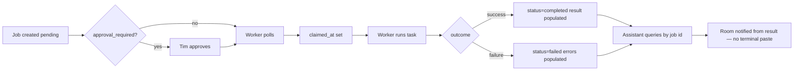

# No-Paste Worker Loop v0

Two related improvements that Tim should not confuse:

| Concept | What it fixes | Tim's action | Assistant action |
|---------|---------------|--------------|------------------|
| **No-paste result lookup** | Pasting terminal logs | Say `done` or paste **job id only** | Query command-channel for `result`, `errors`, status packet |
| **No-manual-claim worker loop** | Starting one JobId at a time | Start **one** persistent worker window before leaving Station 1 | Monitor Bridge Status / status CLI; no terminal paste |

`auto_run_requested=true` on a job means **Tim approved unattended execution**. It does **not** start a worker by itself. A polling worker must be running locally (or recovery must be run per job).

## Why manual `-JobId` was required

1. **`start-juos-worker.ps1` defaults to one-shot** — without `-Loop`, the launcher passes `--once` and the process exits after zero or one claim attempt.
2. **Lane claim is gated** — `command-channel-worker.js` refuses anonymous lane polling in one-shot mode unless `--job-id` or `--allow-lane` is set. Persistent mode enables lane claim internally.
3. **No server-side runner** — the JuOS API stores jobs; it does not invoke Cursor or Station 1. Claim + execute happens only when a worker process polls `GET /worker/jobs/next`.
4. **Hub script exists but is heavy for leave-Station-1** — `scripts/start-worker-hubs.ps1` launches **six** profile windows and requires `XIAOJU_ACTION_TOKEN`. Fine for full hub ops; overkill when only JOA lane is active.

## Intended lifecycle (v0)



Operating rules (unchanged):

- approved ≠ running
- pending ≠ handled
- completed ≠ notified (room post still required until notification ledger exists)

## Station 1 — low-touch JOA worker loop

From a **token-loaded supervisor shell** in `C:\projects\TimOS-Agent`:

```powershell
.\scripts\start-joa-worker-loop.ps1
```

Equivalent (same behavior):

```powershell
.\scripts\start-juos-worker.ps1 -Profile joa -Loop
```

Or via npm (same Node entrypoint, no `-Loop` ps1 wrapper):

```powershell
npm run worker:joa:loop
```

Expected console banner:

```text
Persistent polling hub active worker_profile=joa ...
Press Ctrl+C to stop.
```

Leave this window open while away. When a job is approved for profile `joa`, the worker claims it on the next poll (default 5s, `COMMAND_CHANNEL_POLL_INTERVAL_MS`).

### Full multi-profile hubs (optional)

When Finance, JuCore, Nova, SpaceA, and Ministry lanes must also run:

```powershell
.\scripts\start-worker-hubs.ps1
```

Requires `XIAOJU_ACTION_TOKEN` in the supervisor shell. Validates workspaces, then opens one PowerShell window per profile.

## No-paste result lookup (assistant SOP)

Tim should **not** paste terminal output unless command-channel has no result yet.

### Tim says

- `done` — assistant finds the latest completed/failed job for the active lane, or
- `<job-uuid>` — assistant looks up that job directly.

### Assistant commands (from repo root)

```powershell
# Single job — room-facing packet
node scripts/command-channel-status.js --http --job-id <uuid> --packet --target-room room

# Single job — JSON (result, errors, timestamps)
node scripts/command-channel-status.js --http --job-id <uuid> --json

# All stranded jobs — recovery commands only
node scripts/command-channel-status.js --http --profile joa --recovery

# Full board
node scripts/command-channel-status.js --http --profile joa
```

HTTP mode uses `XIAOJU_ACTION_TOKEN` or `config/auth.json` (`xiaoju-command-channel`). Read-only for status; no claim.

### What to read in the job record

| Field | Use |
|-------|-----|
| `status` | `pending`, `claimed`, `completed`, `failed` |
| `claimed_at` | Proves a worker picked it up |
| `completed_at` | Terminal timestamp |
| `result.summary` | Primary completion text — **prefer over terminal paste** |
| `result.files_seen` | Paths touched |
| `errors` | Failure reasons |

Bridge Status live routes (Station 1 browser, token via curl): see [`bridge-status-ui-v0.md`](./bridge-status-ui-v0.md).

## Per-job recovery (when loop is not running)

If status shows **STRANDED — approved + pending + unclaimed**:

```powershell
node scripts/command-channel-status.js --http --recovery --profile joa
```

Then either start the loop (preferred) or claim one job explicitly:

```powershell
.\scripts\start-juos-worker.ps1 -Profile joa -JobId <uuid>
```

## Remaining gaps (v0)

| Gap | Mitigation now | Future |
|-----|----------------|--------|
| Worker must stay running on Station 1 | `start-joa-worker-loop.ps1` | Always-on Station 4/5 or hosted worker |
| No notification ledger | Manual room post after `completed` | Ledger + auto packet |
| Bridge Status not on phone | CLI / curl on Station 1 | JuOS-hosted `/joa/bridge-status` with session auth |
| `auto_run_requested` does not dispatch | Documented; loop claims approved jobs | Optional server-side queue worker (out of scope) |
| Non-JOA lanes idle unless hubs started | `start-worker-hubs.ps1` | Per-lane activation playbook |

## Recommended next step

1. **Now:** Run `start-joa-worker-loop.ps1` on Station 1 before Travel Mode; assistants use no-paste lookup.
2. **Next:** Deploy Bridge Status to JuOS for phone/MacBook visibility ([`bridge-status-external-v0.md`](./bridge-status-external-v0.md)).
3. **Then:** Always-on worker on Station 4/5 or first non-JOA lane activation when Finance/JuCore/Nova jobs need unattended claim.

## Related

- Stranded detection: [`no-stranded-job-v0.md`](./no-stranded-job-v0.md)
- Finalize path rules: [`finalize-exact-path-sop.md`](./finalize-exact-path-sop.md)
- Bridge UI: [`bridge-status-ui-v0.md`](./bridge-status-ui-v0.md)
- Worker launcher: `scripts/start-juos-worker.ps1`, `scripts/start-joa-worker-loop.ps1`
- Worker core: `scripts/command-channel-worker.js`
